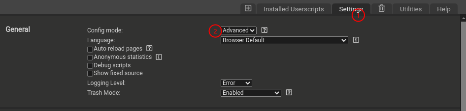
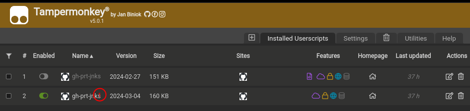
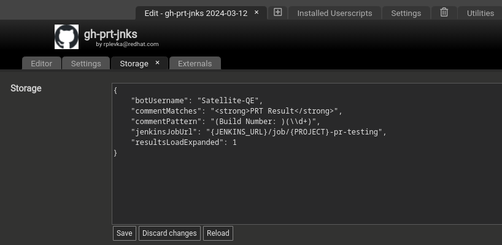
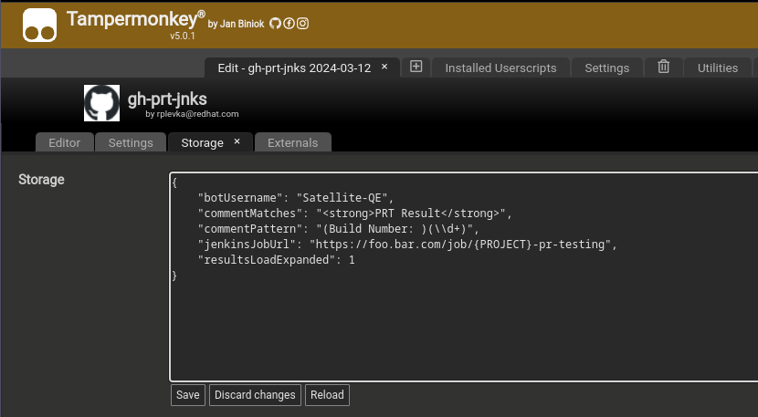
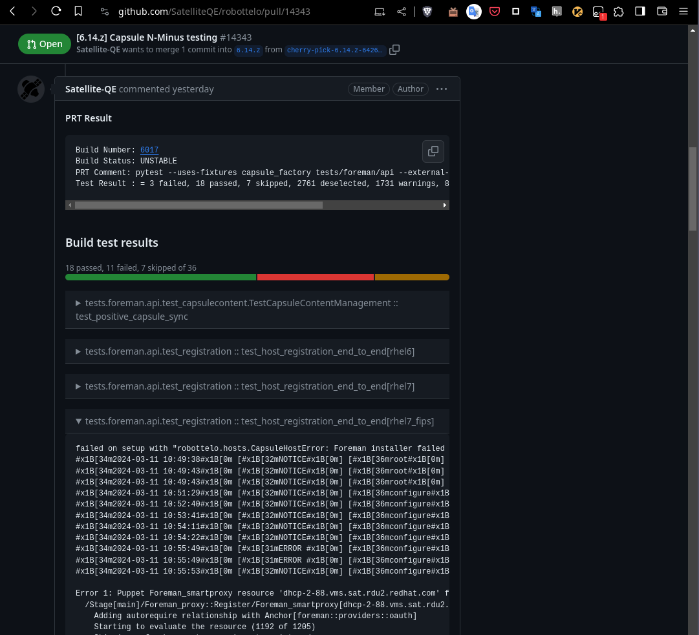

Description
====
Simple userscript that scans PR comments for the ones created by PRT bot and replaces the reported `build number` by the link to the actual jenkins build. 

Setting up
====
1. switch to `advanced` mode in your TamperMonkey settings (it allows you to access and modify the `Storage` of the extension)

2. Navigate to [script raw page](https://github.com/rplevka/gh-prt-jnks/raw/main/gh-prt-jnks.user.js) and TamperMonkey should pop up with confirmation dialog to install the script

3. With the userscript installed and enabled, navigate to any GH PR page (a page of a  specific PR)
Hit refresh (an initial settings should be seeded)

4. Open TamperMonkey dashboard, click the installed script and navigate to the `Storage` tab

    
    
(hit `Reload` button if you can't see the settings object)

5. replace `{JENKINS_URL}` with url to your jenkins instance (including schema). Keep `{PROJECT}` unchanged as this is automatically expanded by the script.
    

6. If you wish to keep the failed items collapsed by default switch `resultsLoadExpanded` to `0`
7. Hit `Save`
8. Navigate to the target PR page and **Hit reload** to rerun the script
    

Known bugs and limitations
===
one needs to refresh the page for script to work (GH manipulates the existing DOM on navigation). GH does not seem to emit the `pjax.end` event anymore. This is currently affecting all GH userscripts.
